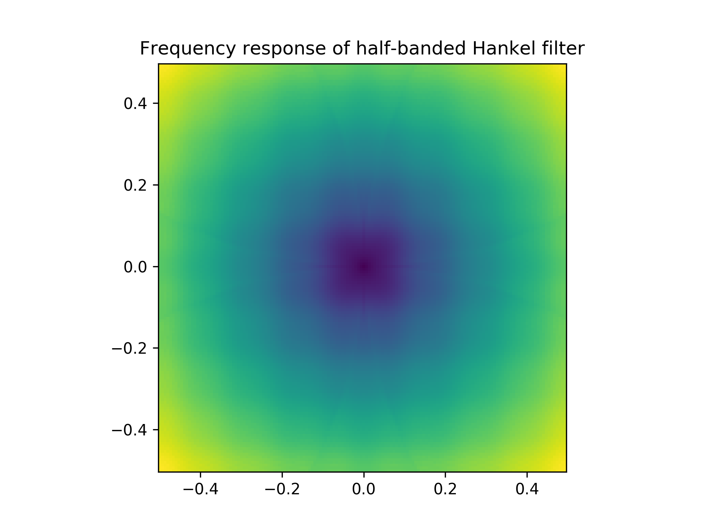

# Texshade: texture-shaded elevation via the fractional-Laplacian operator

## Introduction

See http://www.textureshading.com/Home.html for links to papers and slides by Leland Brown from 2010 and 2014 describing the technique of texture shading, but in summary, it is a method of processing digital elevation maps (DEMs) that highlights the network nature of topography, throwing ridges, canyons, and valleys into sharp relief.

This repository contains an open-source public-domain Python/Numpy software library to apply the texture shading algorithm on *extremely* large datasets. This is a challenge because a straightforward implementation of the texture-shading technique requires loading the entire elevation map into memory. For large datasets—like the ASTER Global DEM, which comes in at roughly 250 GB compressed—you either have to find a computer with a lot of memory (nodes with 1 TB RAM are available at many scientific organizations as of 2018) or you have to modify the technique.

This repository contains (1) mathematical and (2) software details of a low-memory approximation to the original texture-shading algorithm that in practice produces texture-shaded imagery very similar to the full algorithm.

The mathematical trick, in a nutshell, is to use the Hankel transform to find a finite impulse response (FIR) filter that approximates the frequency-domain fractional-Laplacian operator, and apply that filter in the spatial domain via the efficient overlap-save algorithm. According to GitHub commit logs, I first derived this technique in 2015.

## The texture-shading algorithm

The original texture-shading algorithm takes a 2D array of elevations, call it $x$, and computes the texture-shaded elevation map,

$$y = F^{-1}[F[x] ⋅ |\vec f|^α],$$

where
- $F[\cdot]$ is the 2D Fourier transform operator and $F^{-1}[\cdot]$ its inverse
- $\vec f = [f_x, f_y]'$ the 2D vector of Fourier coordinates, so $|\vec f|^α=(f_x^2 + f_y^2)^{α/2}$
- $()'$ indicates matrix or vector transpose
- $0<α≤1$, the "fraction" in the fractional-Laplacian (though Brown gives examples of $α≤2$!).

While many details of the algorithm have yet to be specified, the output array $y$ can be made to have the same size as the input $x$.

Let's implement this in Python.

```py
# export texshade/texshade.py
import scipy.fftpack as scifft
import numpy as np

nextpow2 = lambda v: list(map(int, 2**np.ceil(np.log2(v))))


def texshade(x, alpha, verbose=True):
  Nyx = nextpow2(x.shape)

  fy = scifft.rfftfreq(Nyx[0])[:, np.newaxis].astype(x.dtype)
  fx = scifft.rfftfreq(Nyx[1])[np.newaxis, :].astype(x.dtype)
  H2 = (fx**2 + fy**2)**(alpha / 2.0)
  if verbose:
    print("Generated filter")

  rfft2 = lambda x: scifft.rfft(scifft.rfft(x, Nyx[1], 1, True), Nyx[0], 0, True)
  irfft2 = lambda X: scifft.irfft(scifft.irfft(X, axis=0, overwrite_x=True), overwrite_x=True)

  xr = rfft2(x) * H2
  if verbose:
    print("Completed frequency domain operations")
  H2 = None  # potentially trigger GC here to reclaim H2's memory
  xr = irfft2(xr)
  if verbose:
    print("Back to spatial-domain")

  return xr[:x.shape[0], :x.shape[1]]
```

## Test setup
I've downloaded three tiles from the SRTM DEM (from [this page at SDSC.edu](https://cloud.sdsc.edu/v1/AUTH_opentopography/Raster/SRTM_GL1/SRTM_GL1_srtm/North/North_0_29/)) on the African coastline near 0° N and 0° W and merged them into a single raster using [GDAL](https://gdal.org/), which I installed using [Brew](https://formulae.brew.sh/formula/gdal): installing these is outside the scope of this document, but any DEM you have can be used.
```
wget https://cloud.sdsc.edu/v1/AUTH_opentopography/Raster/SRTM_GL1/SRTM_GL1_srtm/North/North_0_29/N00E009.hgt \
  https://cloud.sdsc.edu/v1/AUTH_opentopography/Raster/SRTM_GL1/SRTM_GL1_srtm/North/North_0_29/N00E010.hgt \
  https://cloud.sdsc.edu/v1/AUTH_opentopography/Raster/SRTM_GL1/SRTM_GL1_srtm/North/North_0_29/N00E011.hgt
gdalwarp -of GTiff N00E009.hgt N00E010.hgt N00E011.hgt merged.tif
```

Running `gdalinfo merged.tif` produces the following output:
```
Driver: GTiff/GeoTIFF
Files: merged.tif
Size is 10801, 3601
Coordinate System is:
GEOGCS["WGS 84",
    DATUM["WGS_1984",
        SPHEROID["WGS 84",6378137,298.257223563,
            AUTHORITY["EPSG","7030"]],
        AUTHORITY["EPSG","6326"]],
    PRIMEM["Greenwich",0],
    UNIT["degree",0.0174532925199433],
    AUTHORITY["EPSG","4326"]]
Origin = (8.999861111111111,1.000138888888889)
Pixel Size = (0.000277777777778,-0.000277777777778)
Metadata:
  AREA_OR_POINT=Point
Image Structure Metadata:
  INTERLEAVE=BAND
Corner Coordinates:
Upper Left  (   8.9998611,   1.0001389) (  8d59'59.50"E,  1d 0' 0.50"N)
Lower Left  (   8.9998611,  -0.0001389) (  8d59'59.50"E,  0d 0' 0.50"S)
Upper Right (  12.0001389,   1.0001389) ( 12d 0' 0.50"E,  1d 0' 0.50"N)
Lower Right (  12.0001389,  -0.0001389) ( 12d 0' 0.50"E,  0d 0' 0.50"S)
Center      (  10.5000000,   0.5000000) ( 10d30' 0.00"E,  0d30' 0.00"N)
Band 1 Block=10801x1 Type=Int16, ColorInterp=Gray
  NoData Value=-32768
  Unit Type: m
```

```py
# export convert.py
"""
Quick script intended to be used only by a user to convert a specific
GeoTIF to a NPY file for pure-Numpy non-GDAL demo.
"""
import numpy as np
import gdal, gdalconst
fname = 'merged.tif'


def filenameToData(fname, dtype=np.float32):
  """Reads all bands"""
  fileHandle = gdal.Open(fname, gdalconst.GA_ReadOnly)
  result = np.squeeze(
      np.dstack(
          [fileHandle.GetRasterBand(n + 1).ReadAsArray() for n in range(fileHandle.RasterCount)]))
  if dtype is not None:
    return result.astype(dtype)
  return result


np.save(fname, filenameToData(fname))
```

```py
# export demo.py
import texshade
import numpy as np
fname = 'merged.tif.npy'

arr = np.load(fname)
print(arr)
tex = texshade.texshade(arr, 0.8)
np.save(fname + '.tex', tex)
```

```py
# export postprocess.py
import numpy as np
from PIL import Image

arr = np.load('merged.tif.npy')

tex = np.load('merged.tif.npy.tex.npy')
minmax = np.quantile(tex.ravel(), [.01, .99])


def touint(x, cmin, cmax, dtype=np.uint8):
  # clamp x between cmin and cmax
  x[x < cmin] = cmin
  x[x > cmax] = cmax
  # map [cmin, cmax] to [0, 2**depth-1-eps] linearly
  maxval = 2**(8 * dtype().itemsize) - 1e-3
  slope = (maxval - 1.0) / (cmax - cmin)
  ret = slope * (x - cmin) + 1
  return (ret).astype(dtype)


scaled = touint(tex, minmax[0], minmax[1], np.uint8)


def toPng(scaled, fname):
  newimage = Image.new('L', (scaled.shape[1], scaled.shape[0]))  # type, (width, height)
  newimage.putdata(scaled.ravel())
  newimage.save(fname)


toPng(scaled, 'scaled.png')
toPng(touint(arr, np.min(arr), np.max(arr), np.uint8), 'orig.png')
```

```
for i in orig.png scaled.png; do convert -filter Mitchell -sampling-factor 1x1 -quality 90 -resize 2048 $i $i.small.png; done
```

### Original


### Tex-shaded


## The approximation

```py
# export hankel.py
import pylab as plt
plt.ion()
from mpmath import hyper
import numpy as np
from scipy import signal
from scipy.signal import convolve2d, convolve
import numpy.fft as fft
import functools
from scipy.interpolate import interp1d


def design(N=32, passbandWidth=0.03):
  if N % 2 != 0:
    raise ValueError('N must be even')
  if N < 2:
    raise ValueError('N must be > 1')
  if not (passbandWidth > 0 and passbandWidth < 0.5):
    raise ValueError('Need 0 < passbandWidth < 0.5')
  bands = np.array([0., .25 - passbandWidth, .25 + passbandWidth, .5])
  h = signal.remez(N + 1, bands, [1, 0], [1, 1])
  h[abs(h) <= 1e-4] = 0.0
  return h


@functools.lru_cache(maxsize=None)
def spatial(r, a, integralMax=np.pi):
  # Wolfram Alpha: `2*pi*Integrate[f^a * BesselJ[0, k * f] * f, f, 0, m]`
  return float(hyper((a / 2.0 + 1,), (1.0, a / 2.0 + 2), -0.25 * (r * integralMax)**2))


def vec(v):
  return v.reshape(v.size, -1)


rvec = np.arange(-150, 150)
rmat = np.sqrt(vec(rvec)**2 + vec(rvec).T**2)

r = np.linspace(np.sqrt(2) * -150 * 1.01, np.sqrt(2) * 150 * 1.01, 10000)
h = np.array(list(map(lambda x: spatial(x, 0.8), r)))
oned = interp1d(r, h)
hmat = oned(rmat)
# hmat = np.reshape(list(map(lambda x: spatial(x, 1.0), rmat.ravel())), rmat.shape)

F2sym = lambda arr: fft.fftshift(fft.fft2(fft.ifftshift(arr)))


def plotF2sym(arr):

  def extents(f):
    delta = f[1] - f[0]
    return [f[0] - delta / 2, f[-1] + delta / 2]

  h, w = arr.shape
  x = np.ceil(np.arange(w) - w / 2) / w
  y = np.ceil(np.arange(h) - h / 2) / h
  plt.figure()
  plt.imshow(
      np.real(F2sym(arr)),
      aspect='equal',
      interpolation='none',
      extent=extents(x) + extents(y),
      origin='lower')


plotF2sym(hmat)
plt.title('Frequency response of full Hankel filter')
plt.savefig('full-hankel.png', dpi=300)
plt.savefig('full-hankel.svg', dpi=300)

hbFilter = design(32)
doubleFilter = convolve2d(
    convolve2d(hmat, vec(hbFilter), mode='same'), vec(hbFilter).T, mode='same')
finalFilter = doubleFilter[:-1:2, :-1:2] if r.size % 4 == 0 else doubleFilter[1:-1:2, 1:-1:2]

plotF2sym(finalFilter)
plt.title('Frequency response of half-banded Hankel filter')
plt.savefig('half-hankel.png', dpi=300)
plt.savefig('half-hankel.svg', dpi=300)
```




The final plot above is the 2D filter that closely-approximates the full-resolution frequency-domain fractional-Laplacian operator.