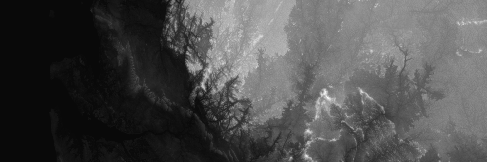
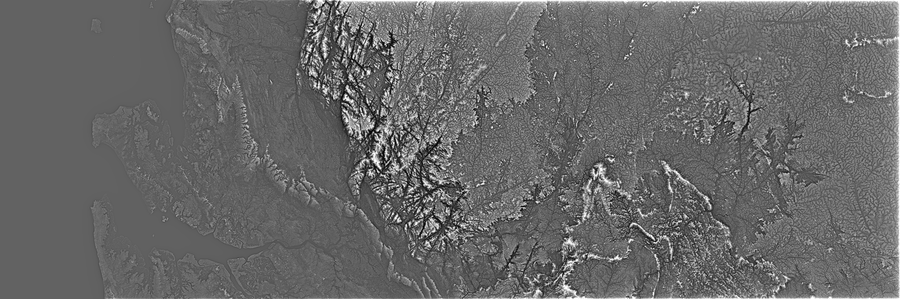
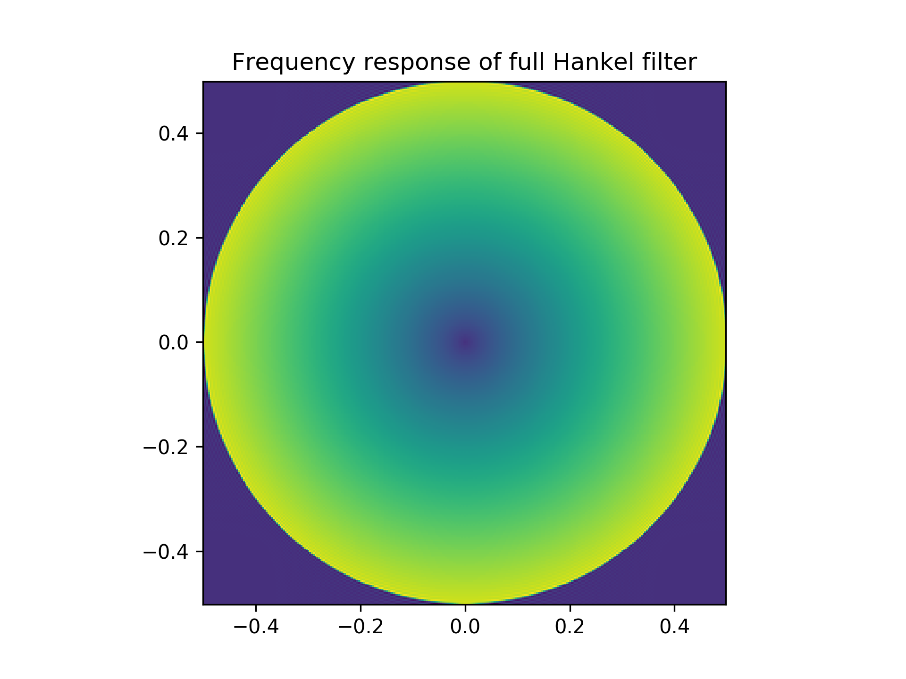
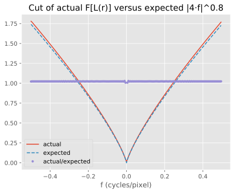
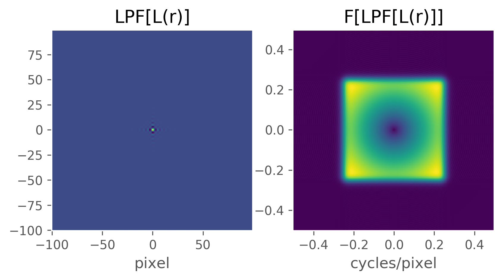
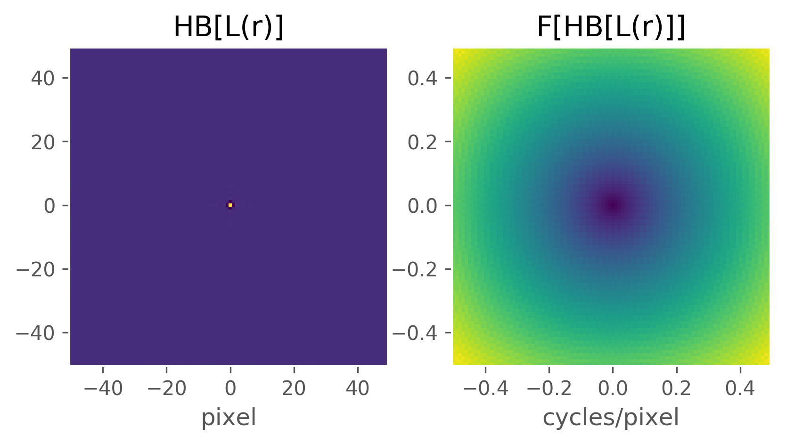
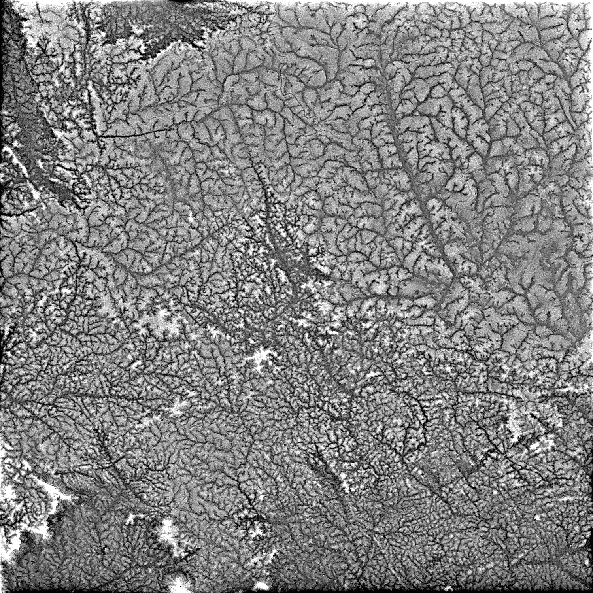
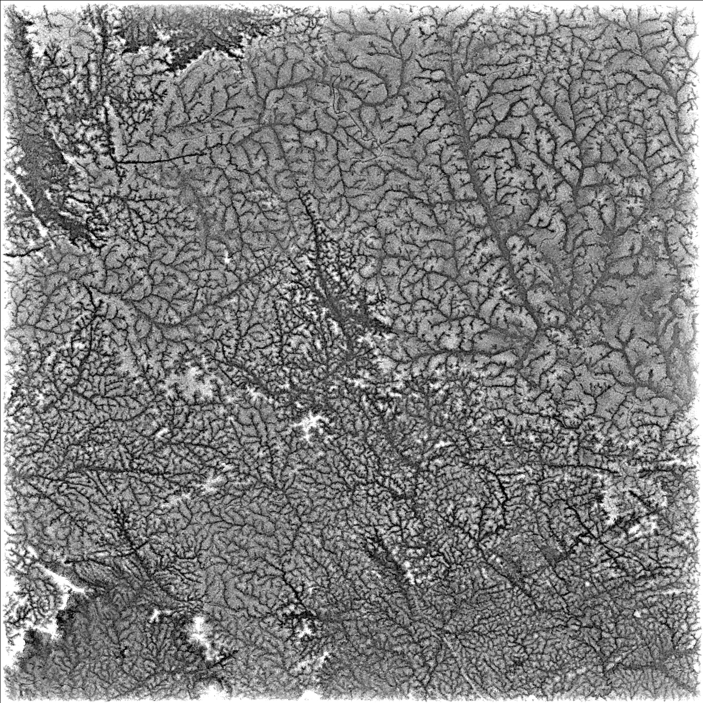
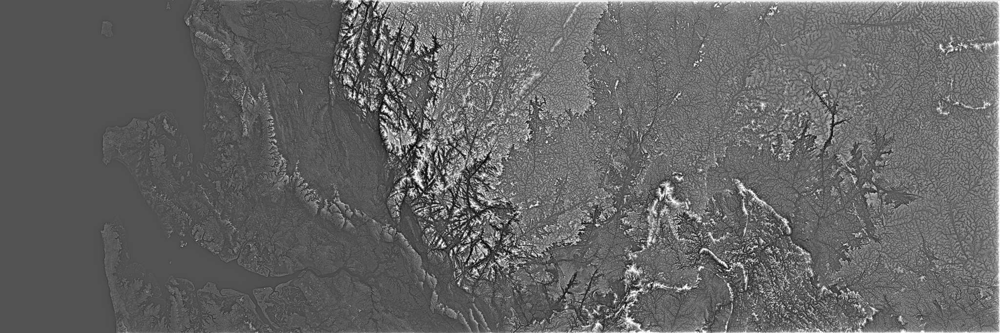

# Texshade: texture-shaded elevation via the fractional-Laplacian operator

## Introduction

See http://www.textureshading.com/Home.html for links to papers and slides by Leland Brown from 2010 and 2014 describing the technique of texture shading, but in summary, it is a method of processing digital elevation maps (DEMs) that highlights the network nature of topography, throwing ridges, canyons, and valleys into sharp relief.

This repository contains an open-source public-domain Python/Numpy software library to apply the texture shading algorithm on *extremely* large datasets. This is a challenge because a straightforward implementation of the texture-shading technique requires loading the entire elevation map into memory. For large datasets—like the ASTER Global DEM, which comes in at roughly 250 GB compressed—you either have to find a computer with a lot of memory (nodes with 1+ TB RAM are available at many scientific organizations as of 2019) or you have to modify the technique.

This repository contains (1) mathematical and (2) software details of a low-memory approximation to the original texture-shading algorithm that in practice produces texture-shaded imagery very similar to the full algorithm.

The mathematical trick, in a nutshell, is to use the Hankel transform to find a finite impulse response (FIR) filter that approximates the frequency-domain fractional-Laplacian operator, and apply that filter in the spatial domain via the efficient overlap-save algorithm. According to GitHub commit logs, I first derived this technique in 2015.

## Installation and usage
To install this library:
```
$ pip install texshade
```
To use it, in your Python code:
```py
import texshade
```

The rest of this document provides examples on using the following two major functions exposed by this library. Their API is as follows.

### `def texshadeFFT(x: np.ndarray, alpha: float) -> np.ndarray` FFT-based texture shading elevation

Given an array `x` of elevation data and an `alpha` > 0, apply the texture-shading algorithm using the full (real-only) FFT: the entire `x` array will be FFT'd.

`alpha` is the shading detail factor, i.e., the power of the fractional-Laplacian operator. `alpha=0` means no detail (output is the input). `alpha=2.0` is the full (non-fractional) Laplacian operator and is probably too high. `alpha <= 1.0` seem aesthetically pleasing.

Returns an array the same dimensions as `x` that contains the texture-shaded version of the input array.

If `x` is memory-mapped and/or your system doesn't have 5x `x`'s memory available, consider using `texshade.texshadeSpatial`, which implements a low-memory version of the algorithm by approximating the frequency response of the fractional-Laplacian filter with a finite impulse response filter applied in the spatial-domain.

Implementation note: this function uses Scipy's FFTPACK routines (in `scipy.fftpack`) instead of Numpy's FFT (`numpy.fft`) because the former can return single-precision float32. In newer versions of Numpy/Scipy, this advantage may have evaporated [1](https://github.com/numpy/numpy/issues/6012), [2](https://github.com/scipy/scipy/issues/2487).

### `texshadeSpatial` Low-memory approximation of the texture shading algorithm
Full signature:
```py
```

Unlike `texshade.texshadeFFT`, which computes an FFT of the entire input elevation array `x` and applies the fractional-Laplacian filter in the frequency domain, this function approximates that frequency response with a spatial-domain finite impulse response (FIR) filter that is applied in the spatial domain via fast-convolution (overlap-save method). This allows `x` to be memory-mapped and/or very large relative to the amount of free system memory.

`alpha` is the shading detail factor, i.e., the power of the
fractional-Laplacian operator. `alpha=0` means no detail (output is the
input). `alpha=2.0` is the full (non-fractional) Laplacian operator and is
probably too high. `alpha <= 1.0` seem aesthetically pleasing.

Returns an array the same dimensions as `x` that contains the texture-shaded
version of the input array.

`nDiameter` specifies the size of the spatial-domain FIR filter to apply to `x`. It is in the same units as `x`. The larger this is, the closer the output will be to the return value of `texshade.texshadeFFT`. This number controls the size of the neighborhood around a given pixel that contribute to that pixel's final texture-shaded value. If this is too small, the output will differ significantly from the full texture shading algorithm. If it is too big, you may run out of memory, because the overlap-save algorithm for fast-convolution will compute FFTs *at least* this size.

**Spatial filter generation keyword args** passed to `texshade.hankel.halfHankel`: see that function's docstring for details, but reasonable values are chosen for these:

- `interpMethod`
- `sampleSpacing`
- `hbTaps`
- `hbTransitionWidth`

**Overlap-save keyword args** passed to `ols.ols` (this function is in the `overlap-save` module on PyPI):

- `size`
- `nfft`
- `out`

`size`, a 2-list, specifies the size of the sub-arrays of the texture-shaded output to compute in each overlap-save step, while `nfft` (also a 2-list) is the size of the zero-padded FFT that will be taken at each overlap-save FFT. The requirement is that `nfft >= size + nDiameter - 1` for both dimensions. If `nfft` isn't provided, suitable numbers with small prime factors will be selected. If `size` isn't specified, a small multiple of `nDiameter` is chosen.

N.B. It is beneficial to make `size` as big as can fit in your system memory. Suppose `nDiameter` is 1000. If you make `size=[15*1024, 15*1024]`, overlap-save will pick `nfft=[16*1024, 16*1024]` or a bit smaller. A 16k by 16k array of float64 (actually, they'll be complex128, but the real-only FFT will only need half as much space, due to Fourier symmetry) uses 2 GB of memory. You'll probably need 4x this much to store all the intermediate FFT-related arrays:

1. the FFT of the spatial filter,
2. the FFT of the roughly 16k by 16k chunk of input
3. the product of the two
4. the inverse-FFT of the product

I assume your input pixels are int16 or float32, so much smaller before FFT than after. So if your system has 8 GB free, you could pick `size=[15*1024, 15*1024]`. A rough equation might be, if your system has `M` GB, let each element of `size` be roughly `np.sqrt(M / 4 * 1024**3 / 8) - nDiameter`.

`out` allows you to specify the output array to store the results in. This is useful when you have a memory-mapped array prepared to accept the output of the algorithm, which will be float64. If `out.dtype` is not `float64`, then Numpy will perform a conversion, which might be expensive. If provided, this is returned. If not specified, a new array is allocated, filled, and returned.

## The texture-shading algorithm

The original texture shading algorithm takes a 2D array of elevations, call it \\(x\\), and computes the texture-shaded elevation map,

$$y = F^{-1}[F[x] ⋅ |\vec f|^α],$$

where
- \\(F[\cdot]\\) is the 2D Fourier transform operator and \\(F^{-1}[\cdot]\\) its inverse
- \\(\vec f = [f_x, f_y]'\\) the 2D vector of Fourier coordinates, so \\(|\vec f|^α=(f_x^2 + f_y^2)^{α/2}\\)
- \\(()'\\) indicates matrix or vector transpose
- \\(0<α≤1\\), the "fraction" in the fractional-Laplacian (though Brown gives examples of \\(α≤2\\)!).

While many details of the algorithm have yet to be specified, the output array \\(y\\) can be made to have the same size as the input \\(x\\).

Let's implement this in Python.

```py
# export texshade/texshade.py
import scipy.fftpack as scifft
import numpy as np
from nextprod import nextprod


def texshadeFFT(x: np.ndarray, alpha: float) -> np.ndarray:
  """FFT-based texture shading elevation

  Given an array `x` of elevation data and an `alpha` > 0, apply the
  texture-shading algorithm using the full (real-only) FFT: the entire `x` array
  will be FFT'd.

  `alpha` is the shading detail factor, i.e., the power of the
  fractional-Laplacian operator. `alpha=0` means no detail (output is the
  input). `alpha=2.0` is the full (non-fractional) Laplacian operator and is
  probably too high. `alpha <= 1.0` seem aesthetically pleasing.

  Returns an array the same dimensions as `x` that contains the texture-shaded
  version of the input array.

  If `x` is memory-mapped and/or your system doesn't have 5x `x`'s memory
  available, consider using `texshade.texshadeSpatial`, which implements a
  low-memory version of the algorithm by approximating the frequency response of
  the fractional-Laplacian filter with a finite impulse response filter applied
  in the spatial-domain.

  Implementation note: this function uses Scipy's FFTPACK routines (in
  `scipy.fftpack`) instead of Numpy's FFT (`numpy.fft`) because the former can
  return single-precision float32. In newer versions of Numpy/Scipy, this
  advantage may have evaporated [1], [2].

  [1] https://github.com/numpy/numpy/issues/6012
  [2] https://github.com/scipy/scipy/issues/2487
  """
  Nyx = [nextprod([2, 3, 5, 7], x) for x in x.shape]

  # Generate filter in the frequency domain
  fy = scifft.rfftfreq(Nyx[0])[:, np.newaxis].astype(x.dtype)
  fx = scifft.rfftfreq(Nyx[1])[np.newaxis, :].astype(x.dtype)
  H2 = (fx**2 + fy**2)**(alpha / 2.0)

  # Define forward and backwards transforms
  rfft2 = lambda x: scifft.rfft(scifft.rfft(x, Nyx[1], 1, True), Nyx[0], 0, True)
  irfft2 = lambda X: scifft.irfft(scifft.irfft(X, axis=0, overwrite_x=True), overwrite_x=True)

  # Compute the FFT of the input and apply the filter
  xr = rfft2(x) * H2
  H2 = None  # potentially trigger GC here to reclaim H2's memory
  xr = irfft2(xr)
  # Return the same size as input
  return xr[:x.shape[0], :x.shape[1]]
```

## Test setup
I've downloaded three tiles from the SRTM DEM (from [this page at SDSC.edu](https://cloud.sdsc.edu/v1/AUTH_opentopography/Raster/SRTM_GL1/SRTM_GL1_srtm/North/North_0_29/)) on the African coastline near 0° N and 0° W and merged them into a single raster using [GDAL](https://gdal.org/), which I installed using [Brew](https://formulae.brew.sh/formula/gdal): installing these is outside the scope of this document, but any DEM you have can be used.
```
wget https://cloud.sdsc.edu/v1/AUTH_opentopography/Raster/SRTM_GL1/SRTM_GL1_srtm/North/North_0_29/N00E009.hgt \
  https://cloud.sdsc.edu/v1/AUTH_opentopography/Raster/SRTM_GL1/SRTM_GL1_srtm/North/North_0_29/N00E010.hgt \
  https://cloud.sdsc.edu/v1/AUTH_opentopography/Raster/SRTM_GL1/SRTM_GL1_srtm/North/North_0_29/N00E011.hgt
gdalwarp -of GTiff N00E009.hgt N00E010.hgt N00E011.hgt merged.tif
```

Running `gdalinfo merged.tif` produces the following output:
```
Driver: GTiff/GeoTIFF
Files: merged.tif
Size is 10801, 3601
Coordinate System is:
GEOGCS["WGS 84",
    DATUM["WGS_1984",
        SPHEROID["WGS 84",6378137,298.257223563,
            AUTHORITY["EPSG","7030"]],
        AUTHORITY["EPSG","6326"]],
    PRIMEM["Greenwich",0],
    UNIT["degree",0.0174532925199433],
    AUTHORITY["EPSG","4326"]]
Origin = (8.999861111111111,1.000138888888889)
Pixel Size = (0.000277777777778,-0.000277777777778)
Metadata:
  AREA_OR_POINT=Point
Image Structure Metadata:
  INTERLEAVE=BAND
Corner Coordinates:
Upper Left  (   8.9998611,   1.0001389) (  8d59'59.50"E,  1d 0' 0.50"N)
Lower Left  (   8.9998611,  -0.0001389) (  8d59'59.50"E,  0d 0' 0.50"S)
Upper Right (  12.0001389,   1.0001389) ( 12d 0' 0.50"E,  1d 0' 0.50"N)
Lower Right (  12.0001389,  -0.0001389) ( 12d 0' 0.50"E,  0d 0' 0.50"S)
Center      (  10.5000000,   0.5000000) ( 10d30' 0.00"E,  0d30' 0.00"N)
Band 1 Block=10801x1 Type=Int16, ColorInterp=Gray
  NoData Value=-32768
  Unit Type: m
```

```py
# export convert.py
"""
Quick script intended to be used only by a user to convert a specific
GeoTIF to a NPY file for pure-Numpy non-GDAL demo.
"""
import numpy as np
import gdal, gdalconst
fname = 'merged.tif'


def filenameToData(fname: str, dtype=np.float32):
  """Reads all bands"""
  fileHandle = gdal.Open(fname, gdalconst.GA_ReadOnly)
  result = np.squeeze(
      np.dstack(
          [fileHandle.GetRasterBand(n + 1).ReadAsArray() for n in range(fileHandle.RasterCount)]))
  if dtype is not None:
    return result.astype(dtype)
  return result


np.save(fname, filenameToData(fname))
```

```py
# export demo.py
import texshade
import numpy as np
fname = 'merged.tif.npy'

arr = np.load(fname)
print(arr)
tex = texshade.texshadeFFT(arr, 0.8)
np.save(fname + '.tex', tex)
```

```py
# export postprocess.py
import numpy as np


def touint(x: np.ndarray, cmin, cmax, dtype=np.uint8) -> np.ndarray:
  """Convert an array to an array of unsigned integers by clamping and scaling

  Given an array of numbers `x`, and the desired min and max values, `cmin` and
  `cmax` respectively, and optionally a `dtype` that defaults to `uint8`, clamp
  the values of `x` to between `cmin` and `cmax` (i.e., if a pixel is less than
  `cmin`, it will be treated as being equal to `cmin`) and scale the values
  linearly to the full range supported by `dtype`. When `dtype` is `np.uint8`,
  e.g., the output will have values between 0 (originally `cmin`) and 255
  (originally `cmax`).
  """
  # clamp x between cmin and cmax
  x[x < cmin] = cmin
  x[x > cmax] = cmax
  # map [cmin, cmax] to [0, 2**depth-1-eps] linearly
  maxval = 2**(8 * dtype().itemsize) - 1e-3
  slope = (maxval - 1.0) / (cmax - cmin)
  ret = slope * (x - cmin) + 1
  return (ret).astype(dtype)


def toPng(scaled: np.ndarray, fname: str):
  """Write a uint8 array `scaled` to a PNG file `fname`"""
  from PIL import Image
  newimage = Image.new('L', (scaled.shape[1], scaled.shape[0]))  # type, (width, height)
  newimage.putdata(scaled.ravel())
  newimage.save(fname)


def texToPng(tex: np.ndarray, fname: str, quantiles=None, borderFractions=None):
  """Quantile a texture-shaded array and write it to 8-bit PNG

  Given `tex`, a 2D array, and a `fname` path to a PNG file, and optionally a
  2-list `quantiles` (defaults to [0.01, 0.99], i.e., 1% and 99%), clamp the
  array to the quantile-values and write to a PNG. If `borderFractions`, also a
  2-list, is given, 

  `[np.round(total * frac) for total, frac in zip(tex.shape, borderFractions)]`
  
  pixels on either side of the border in each dimension are ignored in
  computing the quantiles.
  """
  if quantiles is None:
    quantiles = [0.01, 0.99]
  assert all([x >= 0 and x <= 1 for x in quantiles])
  if borderFractions is None:
    minmax = np.quantile(tex.ravel(), quantiles)
  else:
    assert all([x >= 0 and x < 1 for x in borderFractions])
    border = [int(np.round(total * frac)) for total, frac in zip(tex.shape, borderFractions)]
    slices = tuple(slice(p, -p if p > 0 else None) for p in border)
    minmax = np.quantile(tex[slices].ravel(), quantiles)

  scaled = touint(tex, minmax[0], minmax[1], np.uint8)
  toPng(scaled, fname)


if __name__ == '__main__':
  arr = np.load('merged.tif.npy')
  tex = np.load('merged.tif.npy.tex.npy')
  texToPng(tex, 'scaled.png', quantiles=[.01, .99], borderFractions=[1e-2, 1e-2])
  toPng(touint(arr, np.min(arr), np.max(arr), np.uint8), 'orig.png')
```

```
for i in orig.png scaled.png; do convert -filter Mitchell -sampling-factor 1x1 -quality 90 -resize 2048 $i $i.small.png; done
```

### Original


### Tex-shaded


## The approximation

Is there any way to apply the fractional-Laplacian operator, which is expressed in the frequency-domain as \\(|\vec f|^α ⋅ F[x]\\) for an input array \\(x\\), that *doesn't* require a 2D Fourier transform of \\(x\\)? Recall that the Fourier transform is a unitary operator—that is, \\(F[x]\\) can be seen as a matrix–vector product \\(\underline F ⋅ \underline x\\), where the underlines represent a matrix or vector version of the operator or its input, and \\(\underline F\\) is a unitary matrix (the complex-domain extension of an orthogonal matrix). This indicates that each element of the output of a Fourier transform is a function of each of the input elements (though because it can do this in \\(log(N)\\) operations, instead of \\(N\\), we call it the *fast* Fourier transform (FFT)). There doesn't seem to be a memory-local way to convert the array of elevations to the Fourier domain, since each frequency bin has contributions from each pixel in the elevation array.

But we do know from linear systems theory that multiplication in the frequency domain is equivalent to convolution in the spatial domain. We can ask if there's any structure to the spatial-domain representation of the fractional-Laplacian \\(|\vec f|^α\\), i.e., what is \\(F^{-1}[|\vec f|^α]\\)?

Trawling through the Wikipedia I stumbled on [the Hankel transform and its relationship to the Fourier transform of circularly-symmetric functions](https://en.wikipedia.org/w/index.php?title=Hankel_transform&oldid=901300195#Relation_to_the_Fourier_transform_(circularly_symmetric_case)). Wikipedia notes that for a two-dimensional radial function \\(f(r)\\), its two-dimensional Fourier transform \\(F(\vec k)\\) is

$$F(\vec k) = F(k) = 2π\int_0^{\infty} f(r) ⋅ J_0(k r) \cdot r ⋅ dr,$$
where \\(J_0(⋅)\\) is the Bessel function of the first kind of order 0. In our notation, if we represent the fractional-Laplacian operator as \\(l(\vec f) = l(f) = f^α\\) ("l" for "Laplacian"), its Fourier transform is, according to [Wolfram Alpha](https://www.wolframalpha.com/input/?i=2*pi*Integrate%5Bf%5Ea+*+BesselJ%5B0%2C+k+*+f%5D+*+f%2C+f%2C+0%2C+m%5D),

$$2π\int_0^m f ⋅ f^α J_0(f r) df = 2π \frac{m^{α + 2}}{α + 2} \cdot {}_{1}F_2([α / 2 + 1], [1, α / 2 + 2], -(r ⋅ m / 2)^2)$$
where
- \\(r\\) is my variable for the radius in the spatial domain,
- \\(1F2\\) is a generalized hypergeometric function (not "the" hypergeometric function \\(2F1\\)!), and
- where I left the upper limit of the integral as \\(m\\) (for "max") because we have a bound on the extent of the frequency domain \\(\vec f = [f_x, f_y]'\\), since \\(-π ≤ f_x < π\\) radians per pixel, and same for \\(f_y\\). (Recall this happens because we are working with a discrete-valued array of elevations \\(x\\), so the Fourier transform is a discrete-time Fourier transform (DTFT) and is periodic every 2π radians per pixel.)

> Odd sidebar. My little knowledge of mathematics is exhausted by wondering why, if I omit the 2π in the expression to Wolfram Alpha, it returns a much more complicated expression including Γ functions. Sympy similar story.

The constant factors that accrete when working with Fourier transform pairs are usually incredibly tedious to keep track of, especially when evaluating them with the FFT. My normal practice is to get things working up to a constant factor and then see if I need to worry about that factor.

So let us ask what the Fourier transform of an array containing evaluations of the radial function

$$L(r) = {}_{1}F_2([α / 2 + 1], [1, α / 2 + 2], -(r ⋅ π / 2)^2).$$
We use the maximum of the integral in the Hankel transform is \\(m=π\\). Recall we use "l" and "L" for "Laplacian": \\(L(r)\\) is the Fourier transform of the fractional-Laplacian \\(l(f) = |f|^α\\).

We do this in the code snippet below: we evaluate the above generalized hypergeometric function on a 200×200 array of radii. We assume the array's horizontal and vertical axes run from -100 to 99, i.e., assuming one pixel spacing for each element, compute each element's radius \\(r\\), and evaluate \\(L(r)\\). Then we look at its 2D FFT, which will be all-real because the input is symmetric. (Recall that in general, the Fourier transform of a real vector will contain complex entries but be conjugate-symmetric about the origin. The Fourier transform will contain zero imaginary components only if its input was symmetric about the origin.)

```py
# export math-hankel.py
import numpy as np
from mpmath import hyper
import numpy.fft as fft
import pylab as plt
plt.style.use('ggplot')


def spatial(r, a):
  "Evaluate L(r), proportional to the Fourier transform of |f|**α"
  return float(hyper((0.5 * a + 1,), (1.0, 0.5 * a + 2), -0.25 * (r * np.pi)**2))


xmat, ymat = np.meshgrid(np.arange(-100, 100), np.arange(-100, 100))
rmat = np.sqrt(xmat**2 + ymat**2)
alpha = 0.8
h = np.vectorize(lambda r: spatial(r, alpha))(rmat)
```

Above we use the fabulous [`mpmath`](http://mpmath.org/) package—a pure-Python arbitrary-precision package with extensive support for special functions, quadrature integration, linear algebra, etc., started by Fredrik Johansson in 2007 (when he was a teenager)—to compute the generalized hypergeometric function. Next, we'd like to visualize its Fourier transform—hopefully we see something that looks like \\(|f|^{0.8}\\).

```py
# export math-hankel.py
def F2cent(arr):
  """Origin-centered 2D Fourier transform"""
  return fft.fftshift(fft.fft2(fft.ifftshift(arr)))


def plotF2cent(arr):
  """Given an origin-centered 2D array, plot its 2D Fourier transform"""

  def extents(f):
    delta = f[1] - f[0]
    return [f[0] - delta / 2, f[-1] + delta / 2]

  h, w = arr.shape
  x = np.ceil(np.arange(w) - w / 2) / w
  y = np.ceil(np.arange(h) - h / 2) / h
  fig, (sax, fax) = plt.subplots(1, 2)

  sax.imshow(
      arr,
      aspect='equal',
      interpolation='none',
      extent=extents(x * w) + extents(y * h),
      origin='lower')

  fax.imshow(
      np.real(F2cent(arr)),
      aspect='equal',
      interpolation='none',
      extent=extents(x) + extents(y),
      origin='lower')
  sax.grid(False)
  fax.grid(False)
  sax.set_xlabel('pixel')
  fax.set_xlabel('cycles/pixel')

  return fig, sax, fax


hplots = plotF2cent(h)
hplots[1].set_title('L(r): spatial-domain')
hplots[2].set_title('F[L(r)]: frequency-domain')
plt.savefig('full-hankel.png', dpi=300, bbox_inches='tight')
plt.savefig('full-hankel.svg', bbox_inches='tight')

actual = np.real(F2cent(h))[100, :]
f = np.ceil(np.arange(200) - 200 / 2) / 200
expected = np.abs(f * 4)**alpha
plt.figure()
plt.plot(f, actual, '-', f, expected, '--', f, actual / expected, '.')
plt.xlabel('f (cycles/pixel)')
plt.legend(['actual', 'expected', 'actual/expected'])
plt.title('Cut of actual F[L(r)] versus expected |4⋅f|^0.8')
plt.savefig('full-hankel-actual-expected.png', dpi=300, bbox_inches='tight')
plt.savefig('full-hankel-actual-expected.svg', bbox_inches='tight')
```



Above: an array of evaluating the expression we computed for the Fourier transform of the fractional-Laplacian operator, and it's actual Fourier transform.



Above: Comparing the actual frequency response of our expression for the spatial-domain equivalent of the fractional-Laplacial, versus the expected frequency response, and their difference, which is approximately 1.024.

This is a success! First, note that the 200×200 array on the left is close to zero: it has a bright center, and decays quickly as the radius from the center–origin grows. Next, note that its 2D Fourier transform is indeed what we had hoped: it sweeps out \\(∝|f|^{α=0.8}\\) radially, for angular radii between 0 and π radians (normalized here to cycles instead of radians: the axes between ±0.5 cycles per pixel correspond to ±π radians per pixel). (The symbol "\\(∝\\)" is read as "proportional to".)

The second plot above shows the near-constant ratio between the center-cut through the FFT of the spatial filter \\(L(r)\\) and a scaled version of what we expect. Comparing \\(|4f|^α\\), for \\(α=0.8\\), to the cut through the FFT's output, we see a very-nearly-constant ratio of 1.024. Do note that the actual value inside the absolute value is irrelevant, and amounts only to scaling the texture-shaded output.

**However**, we cannot use \\(L(r)\\) as a spatial-domain equivalent of texture shading because recall that the original algorithm requires

$$y = F^{-1}[F[x] ⋅ |\vec f|^α],$$
but \\(|\vec f|^α\\) includes the *corners* of the frequency domain, not the radial pattern we see from the circular bull's-eye chart above, where the corners in the frequency domain get zero weight. We might use \\(L(r)\\) nonetheless and accept the infidelity to the texture shading algorithm, but we don't need to. If we decimate the spatial-domain filter \\(L(r)\\) by two, then we effectively get the middle-half of its frequency response, which will be \\(∝|f|^α\\) all the way out to its edges. The Scipy ecosystem provides several ways to [design halfband filters](https://docs.scipy.org/doc/scipy/reference/signal.html#filter-design). A simple example to demonstrate the idea will suffice: design an 8th order low-pass Butterworth filter and apply it along rows and columns of the spatial-domain filter, then downsample the result (throw away every other row/column):

```py
# export math-hankel.py
import scipy.signal as sig
lpf = sig.iirfilter(8, 0.5, btype='lowpass', ftype='butter')
hiir = sig.filtfilt(*lpf, sig.filtfilt(*lpf, h, axis=0), axis=1)

lpfplots = plotF2cent(hiir)
decplots = plotF2cent(hiir[:-1:2, :-1:2])

lpfplots[1].set_title('LPF[L(r)]')
lpfplots[2].set_title('F[LPF[L(r)]]')
lpfplots[0].savefig('lpf-hankel.png', dpi=300, bbox_inches='tight')
lpfplots[0].savefig('lpf-hankel.svg', bbox_inches='tight')

decplots[1].set_title('HB[L(r)]')
decplots[2].set_title('F[HB[L(r)]]')
decplots[0].savefig('hb-hankel.png', dpi=300, bbox_inches='tight')
decplots[0].savefig('hb-hankel.svg', bbox_inches='tight')
```

The results are positive: while this filtering process can certainly be improved, we have obtained a spatial-domain filter that closely-approximates the fractional-Laplacian frequency-domain operator needed by the texture shading algorithm.



Above: low-pass-filtered version of our initial spatial-domain-created filter.



Above: halfbanded (decimated) version of our initial spatial-dmain-created filter: this meets the requirements of the original texture shading algorithm.

## A more complete implementation of the approximation

```py
# export texshade/hankel.py
from mpmath import hyper
import numpy as np
from scipy import signal
from scipy.signal import convolve2d
import numpy.fft as fft
import functools
from scipy.interpolate import interp1d
from typing import Dict


@functools.lru_cache(maxsize=None)
def spatial(r: float, a: float, integralMax=np.pi) -> float:
  "Evaluate L(r), proportional to the Fourier transform of |f|**α"
  # Wolfram Alpha: `2*pi*Integrate[f^a * BesselJ[0, k * f] * f, f, 0, m]`
  return float(hyper((0.5 * a + 1,), (1.0, 0.5 * a + 2), -0.25 * (r * integralMax)**2))


def vec(v: np.ndarray) -> np.ndarray:
  "Convert a Numpy array to a column vector"
  return v.reshape(v.size, -1)


def fullHankel(n: int, alpha: float, interpMethod=True, sampleSpacing=None) -> np.ndarray:
  """Build a FIR filter approximating the fractional-Laplacian operator in the
  middle of its frequency response (non-ideal)

  The returned array will be an `2 * n` by `2 * n` array. `alpha` is the scale
  fraction parameter that governs the amount of sharpening done by the
  fractional-Laplacian operator.

  If `interpMethod=True`, then the values in the filter are
  linearly-interpolated from a grid of samples of the true function (via Hankel
  transform, implemented in `hankel.spatial`), sampled every `sampleSpacing`
  pixels. By default this is the case, and `sampleSpacing` is set to 1e-2
  pixels. This grid is saved to disk.

  If `interpMethod=False`, then each pixel in the output array is exactly
  calculated via `hankel.spatial`. This might be much slower.

  The returned array has a Fourier transform of $|f|^α$ where $|f| < π$ radians
  per sample, and zero otherwise: that is, a circle inscribed in the unit square
  that contains the fractal response surrounded by zeros to the corners. This
  isn't exactly the same as the fractional-Laplacian operator, which is $|f|^α$
  for all $|f|$, even out to the corners.

  See `hankel.halfHankel` for the fully-approximating version of this.
  """
  rvec = np.arange(-n, n)
  rmat = np.sqrt(vec(rvec)**2 + vec(rvec).T**2)

  if interpMethod:
    if not sampleSpacing:
      sampleSpacing = 1e-2
    data = precomputeLoad(alpha, np.ceil(np.sqrt(2) * n * 1.01), sampleSpacing)
    oned = interp1d(data['r'], data['h'])
    hmat = oned(rmat)
  else:
    fun = np.vectorize(lambda x: spatial(x, alpha))
    hmat = fun(rmat)
  return hmat


def designHalfband(N: int, transitionWidth: float) -> np.ndarray:
  """Use the Remez exchange to design a halfband low-pass filter

  `N` taps, with `transitionWidth < 0.5` governing the transition band.
  """
  if N % 2 != 0:
    raise ValueError('N must be even')
  if N < 2:
    raise ValueError('N must be > 1')
  if not (transitionWidth > 0 and transitionWidth < 0.5):
    raise ValueError('Need 0 < transitionWidth < 0.5')
  bands = np.array([0., .25 - transitionWidth, .25 + transitionWidth, .5])
  h = signal.remez(N + 1, bands, [1, 0], [1, 1])
  h[abs(h) <= 1e-4] = 0.0
  return h


def halfband(hmat: np.ndarray, taps=128, transitionWidth=0.03) -> np.ndarray:
  """Decimate an array by half

  Design a low-pass halfband filter with `taps` length and with transition band
  `transitionWidth` and apply it to the input array `hmat`, then throw away
  every other sample (2x downsample).
  """
  hbFilter = designHalfband(taps, transitionWidth)
  doubleFilter = convolve2d(
      convolve2d(hmat, vec(hbFilter), mode='same'), vec(hbFilter).T, mode='same')
  n = hmat.shape[0]
  finalFilter = doubleFilter[:-1:2, :-1:2] if n % 4 == 0 else doubleFilter[1:-1:2, 1:-1:2]
  return finalFilter


def halfHankel(n: int,
               alpha: float,
               interpMethod=True,
               sampleSpacing=None,
               hbTaps=128,
               hbTransitionWidth=0.03) -> np.ndarray:
  """Build the FIR filter approximating the fractional-Laplacian operator over
  all frequencies (ideal)

  Returns an `n` by `n` array representing the spatial-domain FIR filter that
  approximates the `alpha`-detail fractional-Laplacian operator in its total
  frequency response. This should be used instead of `hankel.fullHankel`.

  `interpMethod` and `sampleSpacing` keyword arguments per `hankel.fullHankel`,
  which generates the non-ideal spatial filter.

  A half-band filter of `hbTaps` length and with transition band
  `hbTransitionWidth` is designed (via `hankel.designHalfband`) and used to
  decimate the output of `hankel.fullHankel`. This decimated array is returned.
  """
  return halfband(
      fullHankel(n, alpha, interpMethod=interpMethod, sampleSpacing=sampleSpacing),
      taps=hbTaps,
      transitionWidth=hbTransitionWidth)


def precomputeLoad(alpha: float, N: int, spacing: float) -> Dict[str, np.ndarray]:
  """Store and load gridded evaluations of the spatial-domain function
  `hankel.spatial` to disk

  Given `alpha` the detail parameter of the fractional-Laplacian operator, and
  `N` and `spacing`, imagine generating `x = np.arange(0, N, spacing)`. This
  function will return `hankel.spatial` evaluated for each sample of that `x`.

  The data is cached to the current directory, e.g., `hankel-alpha-0.8.npz` for
  `alpha=0.8`. This function will use as much of the pre-computed data from this
  NPZ file as possible, compute whatever is missing from this file, and update
  the file.
  """
  import os.path
  fun = np.vectorize(lambda x: spatial(x, alpha))
  r = np.arange(0, N, spacing)
  fname = 'hankel-alpha-{}'.format(alpha)
  if os.path.isfile(fname + '.npz'):
    npz = np.load(fname + '.npz')
    rsave = npz['x']
    hsave = npz['y']

    rnew = np.sort(np.setdiff1d(r, rsave))
    hnew = fun(rnew) if rnew.size > 0 else []

    r = np.hstack([rsave, rnew])
    h = np.hstack([hsave, hnew])
    idx = np.argsort(r)  # wasteful but resorting 1k vec is fast
    r = r[idx]
    h = h[idx]
  else:
    h = fun(r)
  np.savez(fname, x=r, y=h)
  return dict(r=r, h=h)
```

```py
# export hankel-demo.py
import numpy as np
import texshade
import postprocess
from scipy.signal import fftconvolve

fname = 'merged.tif.npy'
arr = np.load(fname)

clip = True
if clip:
  arr = arr[-1500:, -1500:]

alpha = 0.8

postprocess.texToPng(
    texshade.texshadeFFT(arr, alpha),
    'orig-texshade-alpha-{}{}.png'.format(alpha, '-clip' if clip else ''),
    quantiles=[.01, .99],
    borderFractions=[1e-2, 1e-2])

Nwidth = 500
Nhalfband = 128

h = texshade.hankel.halfHankel(Nwidth, alpha, hbTaps=Nhalfband)
print('halfbanded', h.shape)
postprocess.texToPng(
    fftconvolve(arr, h, mode='same'),
    'hankel-texshade-alpha-{}-n-{}{}.png'.format(alpha, Nwidth, '-clip' if clip else ''),
    quantiles=[.01, .99],
    borderFractions=[1e-2, 1e-2])

hFull = texshade.hankel.fullHankel(Nwidth, alpha)
print('non-halfbanded', hFull.shape)
postprocess.texToPng(
    fftconvolve(arr, hFull, mode='same'),
    'hankel-texshadeFullband-alpha-{}-n-{}{}.png'.format(alpha, Nwidth, '-clip' if clip else ''),
    quantiles=[.01, .99],
    borderFractions=[1e-2, 1e-2])
```

We can compare the output of the original texture shading algorithm:



with that of the Hankel approximation:



Both are very close. Toggling between them only reveals slight contrast differences due to the different levels obtained for the quantiles—these differences are likely caused by the artifacts at the edges.

In the above demo code, we ask Scipy's [`fftconvolve`](https://docs.scipy.org/doc/scipy/reference/generated/scipy.signal.fftconvolve.html) to apply the spatial-domain filtering, which behind the scenes uses a full-sized FFT just like the original method. However, we can make this much more memory-efficient, while retaining its speed, by using the overlap-add (or overlap-save) technique of fast-convolution.

## Overlap-save method for fast-convolution
The textbook definition of convolving two signals in the spatial domain is a quadratic \\(O(N^2)\\) operation. Since convolution in the spatial domain is mathematically equivalent to multiplication in the frequency domain, and the FFT is a log-linear \\(O(N \log N)\\) operation, this is usually much faster—this is why we use `fftconvolve` above. The drawback of the FFT-based alternative to direct convolution is that it requires we run the FFT on the signals of interest—with a potentially prohibitive memory burden.

The overlap-save method (and its closely-related sibling, the overlap-add method) allow us to convolve signals more intelligently: it still uses FFTs, so the overall theoretical runtime complexity remains log-linear, but it uses *many small* FFTs so memory consumption remains reasonable. I prefer overlap-save because it partitions the *output* array into non-overlapping segments that each step of the algorithm fills in (and which may be parallelized). Each step of the overlap-save algorithm reaches for segments of *input* that may overlap with other steps, but this overlap is read-only.

> In contrast, overlap-add splits the *input* array into non-overlapping segments. Each step of that algorithm has to potentially modify previously-computed samples of the *output*, which makes parallelization much more nasty (requiring locks or careful orchestration of the sequence of steps).

The overlap-save implementation I wrote is largely out of the scope of this texture shading library, so let's just import it and show how we can use it, along with memory-mapped inputs and outputs to *really* save memory.

```py
# export texshade/texshade.py
from ols import ols
from .hankel import halfHankel


def texshadeSpatial(
    x: np.ndarray,
    alpha: float,
    # halfHankel args
    nDiameter: int,
    # halfHankel kwargs
    interpMethod=True,
    sampleSpacing=None,
    hbTaps=128,
    hbTransitionWidth=0.03,
    # ols kwargs
    size=None,
    nfft=None,
    out=None,
) -> np.ndarray:
  """Low-memory approximation of the texture shading algorithm

  Unlike `texshade.texshadeFFT`, which computes an FFT of the entire input
  elevation array `x` and applies the fractional-Laplacian filter in the
  frequency domain, this function approximates that frequency response with a
  spatial-domain finite impulse response (FIR) filter that is applied in the
  spatial domain via fast-convolution (overlap-save method). This allows `x` to
  be memory-mapped and/or very large relative to the amount of free system
  memory.

  `alpha` is the shading detail factor, i.e., the power of the
  fractional-Laplacian operator. `alpha=0` means no detail (output is the
  input). `alpha=2.0` is the full (non-fractional) Laplacian operator and is
  probably too high. `alpha <= 1.0` seem aesthetically pleasing.

  Returns an array the same dimensions as `x` that contains the texture-shaded
  version of the input array.

  `nDiameter` specifies the size of the spatial-domain FIR filter to apply to
  `x`. It is in the same units as `x`. The larger this is, the closer the output
  will be to the return value of `texshade.texshadeFFT`. This number controls
  the size of the neighborhood around a given pixel that contribute to that
  pixel's final texture-shaded value. If this is too small, the output will
  differ significantly from the full texture shading algorithm. If it is too
  big, you may run out of memory, because the overlap-save algorithm for
  fast-convolution will compute FFTs *at least* this size.

  **Spatial filter generation keyword args** passed to
  `texshade.hankel.halfHankel`: see that function's docstring for details, but
  reasonable values are chosen for these:

  - `interpMethod`
  - `sampleSpacing`
  - `hbTaps`
  - `hbTransitionWidth`

  **Overlap-save keyword args** passed to `ols.ols` (this function is in the
  `overlap-save` module on PyPI):

  - `size`
  - `nfft`
  - `out`

  `size`, a 2-list, specifies the size of the sub-arrays of the texture-shaded
  output to compute in each overlap-save step, while `nfft` (also a 2-list) is
  the size of the zero-padded FFT that will be taken at each overlap-save FFT.
  The requirement is that `nfft >= size + nDiameter - 1` for both dimensions. If
  `nfft` isn't provided, suitable numbers with small prime factors will be
  selected. If `size` isn't specified, a small multiple of `nDiameter` is
  chosen.
  
  N.B. It is beneficial to make `size` as big as can fit in your system memory.
  Suppose `nDiameter` is 1000. If you make `size=[15*1024, 15*1024]`,
  overlap-save will pick `nfft=[16*1024, 16*1024]` or a bit smaller. A 16k by
  16k array of float64 (actually, they'll be complex128, but the real-only FFT
  will only need half as much space, due to Fourier symmetry) uses 2 GB of
  memory. You'll probably need 4x this much to store all the intermediate
  FFT-related arrays:

  1. the FFT of the spatial filter,
  2. the FFT of the roughly 16k by 16k chunk of input
  3. the product of the two
  4. the inverse-FFT of the product

  I assume your input pixels are int16 or float32, so much smaller before FFT
  than after. So if your system has 8 GB free, you could pick `size=[15*1024,
  15*1024]`. A rough equation might be, if your system has `M` GB, let each
  element of `size` be roughly `np.sqrt(M / 4 * 1024**3 / 8) - nDiameter`.

  `out` allows you to specify the output array to store the results in. This is
  useful when you have a memory-mapped array prepared to accept the output of
  the algorithm, which will be float64. If `out.dtype` is not `float64`, then
  Numpy will perform a conversion, which might be expensive. If provided, this
  is returned. If not specified, a new array is allocated, filled, and returned.
  """
  h = halfHankel(
      nDiameter,
      alpha,
      interpMethod=interpMethod,
      sampleSpacing=sampleSpacing,
      hbTaps=hbTaps,
      hbTransitionWidth=hbTransitionWidth,
  )

  return ols(x, h, size=size, nfft=nfft, out=out)
```

```py
# export hankel-memmap.py
import numpy as np
from texshade import texshadeSpatial
import postprocess

fname = 'merged.tif.npy'
arr = np.load(fname, mmap_mode='r')

alpha = 0.8
Nwidth = 500
Nhalfband = 128

tex = np.lib.format.open_memmap('mmap-tex.npy', mode='w+', dtype=np.float64, shape=arr.shape)

texshadeSpatial(arr, alpha, Nwidth, hbTaps=Nhalfband, out=tex, size=[2000, 2000])

postprocess.texToPng(
    tex,
    'hankel-texshade-alpha-{}-n-{}-mmap.png'.format(alpha, Nwidth),
    quantiles=[.01, .99],
    borderFractions=[1e-2, 1e-2])
```

To downsample this large image for including with this repo:
```
convert -filter Mitchell -sampling-factor 1x1 -quality 90 -resize 2048 hankel-texshade-alpha-0.8-n-500-mmap.png hankel-texshade-alpha-0.8-n-500-mmap.png.small.png
```



This image is qualitatively identical to the original texture-shaded output [previously shown](#tex-shaded) but to reemphasize: while the [original](#tex-shaded) texture-shaded image involved slurping the entire dataset into memory, and then computing huge FFTs of it, the image just above, generated by the `hankel-memmap.py` script, sipped memory: it loaded the input array as a memory-mapped file, allocated the output as a memory-mapped file, and used a spatial-domain filter to approximate the frequency-domain operator in the original image. By using the overlap-save method of fast-convolution, the filter was applied on small chunks of the data.

We can finally run the texture shading algorithm on enormous datasets without needing gargantuan amounts of memory.

## Developing this repository

## Acknowledgements
John Otander's [Retro](http://markdowncss.github.io/retro/) CSS theme. KaTeX for rendering equations.