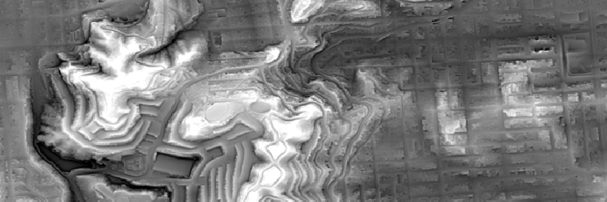
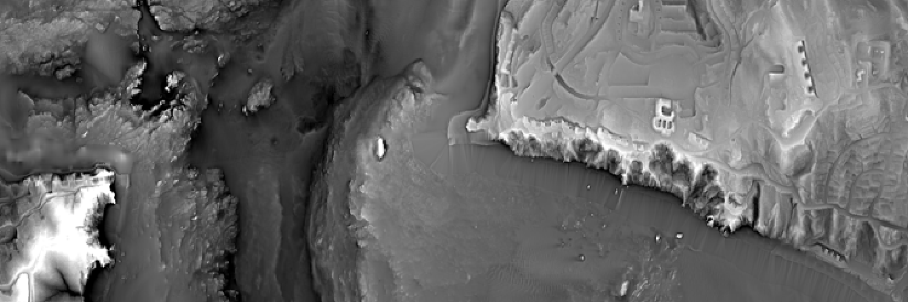
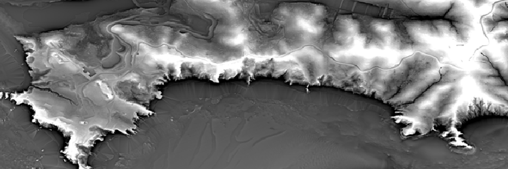
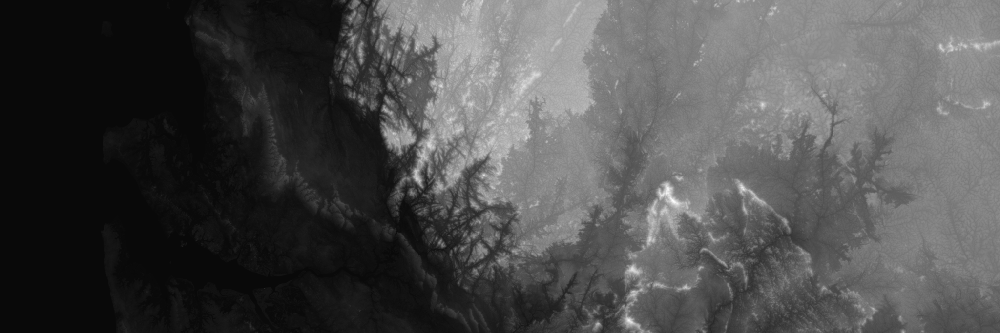
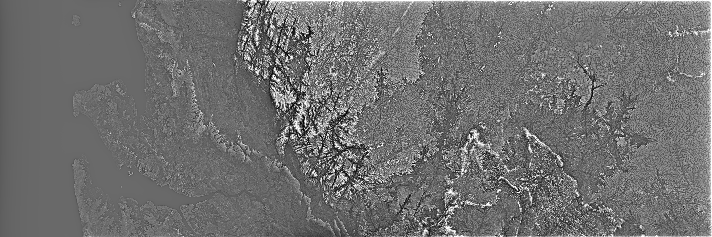
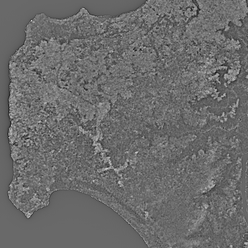
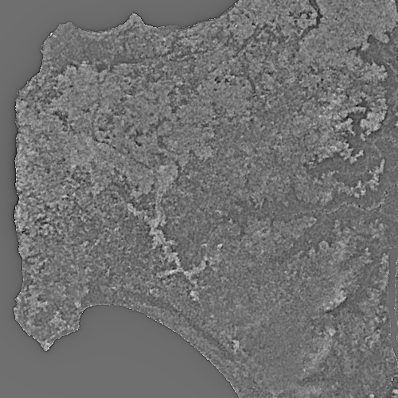
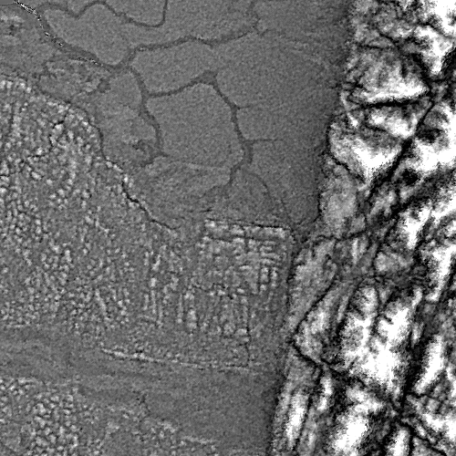
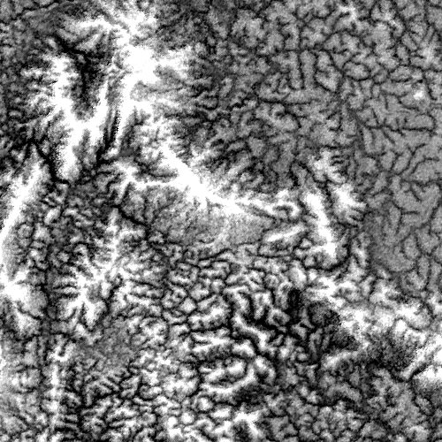
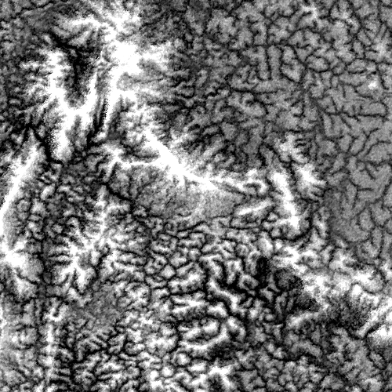

# Texshade

Texture-shaded elevation via the fractional-Laplacian operator.


(Above: Mount Sutro and Twin Peaks, San Francisco, at 1:20,000: texshaded at α=0.8)


Golden Gate Bridge, Marin to the left, San Francisco to the right, at 1:20,000: texshaded at α=0.8


(Above: Marin County Headlands, at 1:20,000: texshaded at α=0.8)

Table of contents:

- [Texshade](#texshade)
  - [Introduction](#introduction)
  - [Installation](#installation)
  - [API](#api)
    - [`texshadeFFT`](#texshadefft)
    - [`texshadeSpatial`](#texshadespatial)
    - [`makeFilter`](#makefilter)
  - [Tutorial](#tutorial)
    - [Get the tutorial code](#get-the-tutorial-code)
    - [Install dependencies](#install-dependencies)
      - [Install Miniconda](#install-miniconda)
      - [Create a new conda env and install dependencies](#create-a-new-conda-env-and-install-dependencies)
    - [Download data](#download-data)
    - [Convert the elevation data to a Numpy array](#convert-the-elevation-data-to-a-numpy-array)
    - [Run texshade!](#run-texshade)
    - [Clamp, quantize, and export](#clamp-quantize-and-export)
    - [Rescale for the web](#rescale-for-the-web)
      - [Original DEM](#original-dem)
      - [Tex-shaded DEM](#tex-shaded-dem)
    - [Spatial filtering and fast-convolution for low-memory usage](#spatial-filtering-and-fast-convolution-for-low-memory-usage)
      - [Crop 1](#crop-1)
      - [Crop 2](#crop-2)
      - [Crop 3](#crop-3)

## Introduction

The best way to understand texture-shaded elevation is to look at some examples: we gave some at the top of this document, but also take your time at the following links to get a visual sense of world with texture shading.

1. Leland Brown's [textureshading.com](http://www.textureshading.com/Home.html) is a great start because that's the inventor of the technique, and the website contrasts raw terrain, texture-shaded terrain, and more conventional hillshaded terrain. (There are also links to papers/slides from 2010 and 2014 describing the technique of texture shading in detail.)
2. My blog post also contains some pretty images, mashing up various basemaps with texture-shaded terrain: [Texture-shaded Globe](https://fasiha.github.io/post/texshade/).
3. Zoran Čučković's [QGIS plugin](https://landscapearchaeology.org/2021/texture-shading/) also has some captivating images.

In words though, *texture shading* is a visualization technique for digital elevation maps (DEMs) that highlights the network nature of topography, throwing ridges, canyons, and valleys into sharp relief.

(In *more* words: it works by applying a specific sharpening filter, called a fractional-Laplacian operator, to the elevation. The filter is applied in the frequency domain.)

This repository contains an open-source public-domain Python/Numpy software library to apply the texture shading algorithm on *extremely* large datasets that are far too large to fit in your computer's memory.

This is useful because a straightforward implementation of the texture-shading technique requires loading the entire elevation map into memory. For large datasets—like the ASTER Global DEM, which comes in at roughly 250 GB compressed—you either have to find a computer with a lot of memory, or you have to modify the technique slightly.

So in this repository, we apply a well-known trick from signal processing theory, called the *overlap-save method*, to avoid loading the entire terrain into memory 😁. However, this trick requires us to approximate the exact texture-shading "filter" slightly 😕. In exchange for being able to process huge elevation datasets, you need to accept approximated texture-shaded images—*visually* you can barely tell the difference 🎆!

> (Don't worry, you can use this repo to texture-shade smaller elevation maps as well 😊!)

## Installation
To install this library:
```
$ python -m pip install texshade
```

To use it, in your Python code:
```py
import texshade
```

## API
There are just three functions in the API. This can serve as a quick introduction to the algorithm itself.

### `texshadeFFT`

API:
```py
def texshadeFFT(x: np.ndarray, alpha: float) -> np.ndarray
```

This applies the texture shading algorithm to an array `x` of elevation data, with a shading detail factor `alpha` >= 0.

*This is the exact, high-memory, classic implementation of texture shading.* It computes a real-only FFT of the entire array `x`. Use this if your `x` fits comfortably in RAM: this function is fast and exact.

`alpha` is the shading detail factor, i.e., the power of the fractional-Laplacian operator. `alpha=0` means no detail (output is the same as the input). `alpha=2.0` is the full (non-fractional) Laplacian operator and is probably too high. `alpha <= 1.0` seem aesthetically pleasing.

### `texshadeSpatial`

API: 
```python
def texshadeSpatial(
    x: np.ndarray,
    alpha: Optional[float] = None,
    nDiameter: Optional[int] = None,
    filter: Optional[np.ndarray] = None,
    # ols kwargs
    size=None,
    nfft=None,
    out=None,
    **kwargs
) -> np.ndarray
```

**This is the low-memory approximation of the texture shading algorithm**. It convolves the input array with an FIR (finite impulse response) approximation of the true fractional-Laplacian operator using an FFT-accelerated overlap-save algorithm ("fast-convolution"). This allows `x` to be arbitrarily large: data can be stored on disk and loaded as a memory-mapped array.

Instead of computing the entire FFT of the input array `x` (like `texshade.texshadeFFT`), this function can either
1. *generate* the smaller spatial-domain filter (the approximation to the true Laplacian) to be a square array with dimensions `nDiameter` per side and for shading detail factor `alpha` (for tips on picking `alpha`, see notes for `texshade.texshadeFFT` above), or
2. *reuse* the `filter` you've already generated via `texshade.makeFilter` (see below).

**Background on `nDiameter`** In the *exact* fractional-Laplacian operator implemented in `texshade.texshadeFFT` (above), each pixel in the output theoretically gets a contribution from *each* pixel of the input. *This function*, in contrast, limits contributions to a given output pixel to just the `nDiameter` by `nDiameter` sub-array that surrounds it in the original. 

**Tips on picking `nDiameter`** There's a risk to making `nDiameter` too small or too large:
- if this is too small, the approximation will be inaccurate and you'll get ugly output. You want it big enough so each `nDiameter` by `nDiameter` pixel sub-array of terrain `x` has a rich set of physical features.
- If this is too large, then you'll run out of RAM performing even the small FFTs needed by the overlap-save fast-convolution.

The three remaining keyword arguments are for the overlap-save ("ols") algorithm that does the fast-convolution and are important to understand when you need to texture-shade huge datasets. They are fully documented in the [docstring](./texshade/texshade.py), so I won't duplicate that here.

This function will also pass any other keyword arguments `kwargs` to the [`ols` overlap-save](https://github.com/fasiha/overlap_save-py) module. This lets you override the Scipy FFT with, for example, multi-threaded PyFFTW, etc.

### `makeFilter`

API:
```py
def makeFilter(shape: List[int], alpha: float, dtype=float) -> np.ndarray
```

**This function returns the filter** (i.e., the approximation to the fractional-Laplacian operator) to use with `texshade.texshadeSpatial`). The output array has dimensions `shape` and type `dtype`. If `shape` has just one element, the output array will be square. If your terrain is a Numpy array of type `float32`, pass in `dtype=numpy.float32`, otherwise it defaults to 64-bit floats.

The shading factor `alpha` is the same as `texshade.texshadeFFT` above.

That should be all you need to start using this library! The rest of this document is a tutorial that describes all the other pieces you are likely to need to use this library effectively.

## Tutorial

Let's work through an the entire pipeline that texture shading is a part of:
- getting some raw digital elevation data as multiple files,
- merging them into a single file,
- applying the texture shading algorithm,
- quantizing the results so each pixel is a byte (256 levels), and
- emitting a georegistered texture-shaded terrain as PNG, ready for the web, QGIS, etc.


### Get the tutorial code
There are a few useful scripts in the [./tutorial](./tutorial) directory of this repo. Download them individually, or just clone this repo (install [Git](https://git-scm.com/), run `git clone https://github.com/fasiha/texshade-py.git; cd texshade-py/tutorial`).

### Install dependencies
This section is about installing GDAL, imagemagick, and two Python libraries, Pillow and `texshade` itself. Skip to the [data](#download-data) step if you have all those installed.

Because setting up GDAL is often a tricky and laborious process, there are many tutorials online—I'd like to share my approach because it's easy, reliable, cross-platform.

#### Install Miniconda
Install [miniconda](https://docs.conda.io/en/latest/miniconda.html), a small command-line application that lets you create conda-based virtual environments, and download/install dependencies.

> Conda is awesome. I avoided it for years because it seemed corporate (Enthought), and because I thought I didn't need another Python environment manager beyond venv? But conda-forge is a fully volunteer-run organization that packages all kinds of dependencies for all feasible operating systems and CPU architectures. So it's perfect for us to install the C++ and Python GDAL tools.

#### Create a new conda env and install dependencies
```bash
# create environment
conda create -n texshade-tutorial
# "enter" the environment
conda activate texshade-tutorial
# install binary dependencies
conda install -c conda-forge gdal Pillow imagemagick
# install this repo
pip install texshade
```
We ask conda to install `gdal`, which is a Swiss Army chainsaw for geographic data process. `Pillow` and `imagemagick` are used by the tutorial to create and manipulate images. Pip is used to install `texshade` (this library) from PyPI since I haven't created a conda-forge recipe for it.

### Download data
Download some data! I've downloaded three tiles from the SRTM DEM (from https://dwtkns.com/srtm30m/) on the African coastline near 0° N and 0° W, because I've been loving John K Thornton's *Africa and Africans in the Making of the Atlantic World, 1400-1800*:
- N00E009.SRTMGL1.hgt.zip
- N00E010.SRTMGL1.hgt.zip
- N00E011.SRTMGL1.hgt.zip

Unzip all three—a useful shell script for macOS/Linux/WSL: 
```bash
for i in *.hgt.zip; do unzip $i; done
```
and then combine them into a single "image", `merged.vrt`:
```bash
gdalbuildvrt merged.vrt N00E009.hgt N00E010.hgt N00E011.hgt
```

> VRT is really cool! It's just a little text file that just points to the files on disk with the actual data, and it Just Works with all of GDAL tooling.

Running `gdalinfo merged.vrt` produces the following output:
```
Driver: VRT/Virtual Raster
Files: merged.vrt
       N00E009.hgt
       N00E010.hgt
       N00E011.hgt
Size is 10801, 3601
...
Origin = (8.999861111111111,1.000138888888889)
Pixel Size = (0.000277777777778,-0.000277777777778)
Corner Coordinates:
Upper Left  (   8.9998611,   1.0001389) (  8d59'59.50"E,  1d 0' 0.50"N)
Lower Left  (   8.9998611,  -0.0001389) (  8d59'59.50"E,  0d 0' 0.50"S)
Upper Right (  12.0001389,   1.0001389) ( 12d 0' 0.50"E,  1d 0' 0.50"N)
Lower Right (  12.0001389,  -0.0001389) ( 12d 0' 0.50"E,  0d 0' 0.50"S)
Center      (  10.5000000,   0.5000000) ( 10d30' 0.00"E,  0d30' 0.00"N)
Band 1 Block=128x128 Type=Int16, ColorInterp=Undefined
  NoData Value=-32768
```
This looks good: we have a 10801 by 3601 image whose center is close to the equator, as expected. We do note that there’s a special value, -32768 (`-2**15`), for missing data.

### Convert the elevation data to a Numpy array
To confine GDAL and geo-registered images to the edges of my workflow, I want to convert this elevation data to a simple Numpy array. [`convert.py`](./tutorial/convert.py) does that (and takes care of that `NoData Value`), so run it:
```
python convert.py
```
This creates a new file, `merged.vrt.npy`.

### Run texshade!
It's time to apply the texture-shading algorithm—what you've all come for! [`demo.py`](tutorial/demo.py) exercises the `texshade` library published by this repo. I've picked α of 0.8, and it runs the memory-intensive `texshadeFFT` implementation.
```
python demo.py
```
This creates a new file, `merged.vrt.npy.tex.npy` (note the "tex" in the filename).

### Clamp, quantize, and export
I always clamp the texture-shaded array to between, say, 1-percentile and 99-percentile, to improve the base contrast. (Apps, like my [Texture-Shaded Globe](https://fasiha.github.io/post/texshade/), let you add even more contrast.)

Then I quantize the floating-point data to 8 bits and write a georegistererd TIF, which is great for QGIS and other GIS tooling, but it's also nice to have a PNG to post on social media.

So [`postprocess.py`](tutorial/postprocess.py) takes care of this. Run it
```
python postprocess.py
```
then follow the instructions to generate PNGs, specifically,
```
gdal_translate scaled.tif scaled.png
gdal_translate -scaled merged.vrt orig.png
```
to create
- `scaled.tif`, the texture-shaded GeoTIFF,
- `scaled.png` , the texture-shaded 8-bit PNG, and
- `orig.png`, the original DEM data as an 8-bit PNG, for comparison.

### Rescale for the web
The PNG generated in the above image is way too big for the web. This next Bash command uses imagemagick's `convert` (installed by conda above) to resize the output images so I can include them in this repo.
```bash
for i in orig.png scaled.png; do
  convert -filter Mitchell -sampling-factor 1x1 -quality 90 -resize 2048 $i $i.small.png;
done
```


#### Original DEM


#### Tex-shaded DEM


> I hope the tutorial scripts above, `convert.py`, `demo.py`, and `postprocess.py` (and the script below), are reusable! They should be readily adaptable to a wide variety of data and applications.

### Spatial filtering and fast-convolution for low-memory usage
When we called `texshadeFFT` above, Python computed the two-dimensional FFT of the *entire* elevation array. This means that your computer had enough memory to store 
1. not just the entire elevation array but also
2. its (real-only) Fourier transform,
3. the fractional-Laplacian frequency-domain filter (the frequency vector's norm raised to power α).

Even if we didn't store #3 above (e.g., if we used Numba to modify #2 in-place), since FFTW cannot do in-place Fourier transforms, we're still left with needing 3× the entire elevation array in free memory. 

Imagine that we wanted to texture-shade our data on a tiny computer with a huge disk. We can load it as a memory-mapped file, so Numpy only reads the chunks of data it needs from disk to RAM, and run `texshadeSpatial`. This is demonstrated in [memmap.py](./tutorial/memmap.py). Run it:
```
python memmap.py
```
and follow the instructions to convert from GeoTIFF to PNG:
```
gdal_translate mmap.tif mmap.png
```
to produce a file, `mmap.png`.

I used a 500 by 500 spatial filter: each pixle in the output image received contributions from the 500 by 500 pixel grid around it in the input, and *no* contribution from pixels outside that neighborhood.

The keyword argument `size=[1500, 2000]` was provided to `texshadeSpatial`. As explained in the docstring, this means that the overlap-save algorithm will take two-dimensional FFTs of roughly `size + nDiameter - 1 = [1999, 2499]`. (We zeropad the input to FFT sizes with small prime factors, so each FFT will actually be 2000 by 2500.) This is much smaller than a full 2D FFT of the entire 3601 by 10801 input array.

Note that the overlap-save algorithm, while overall efficient, is going to be slower than the single-large-FFT in `texshadeFFT`. Furthermore, memory-mapping and disk-I/O is also going to be much slower than RAM. As is hopefully clear, you only want to use `texshadeSpatial` if you don't have the RAM for `texshadeFFT`.

Let's generate a few crops (using `convert` from `imagemagick`, installed by conda above):
```
for i in mmap.png scaled.png; do 
  convert -crop 500x500+1090+1341 $i crop1-$i;
  convert -crop 500x500+3300+202 $i crop2-$i;
  convert -crop 500x500+7054+1968 $i crop3-$i;
done
```
Inspecting these, the only differences I see are due to slight differences in the contrast.

#### Crop 1




#### Crop 2




#### Crop 3




We can finally run the texture shading algorithm on enormous datasets without needing gargantuan amounts of memory!
